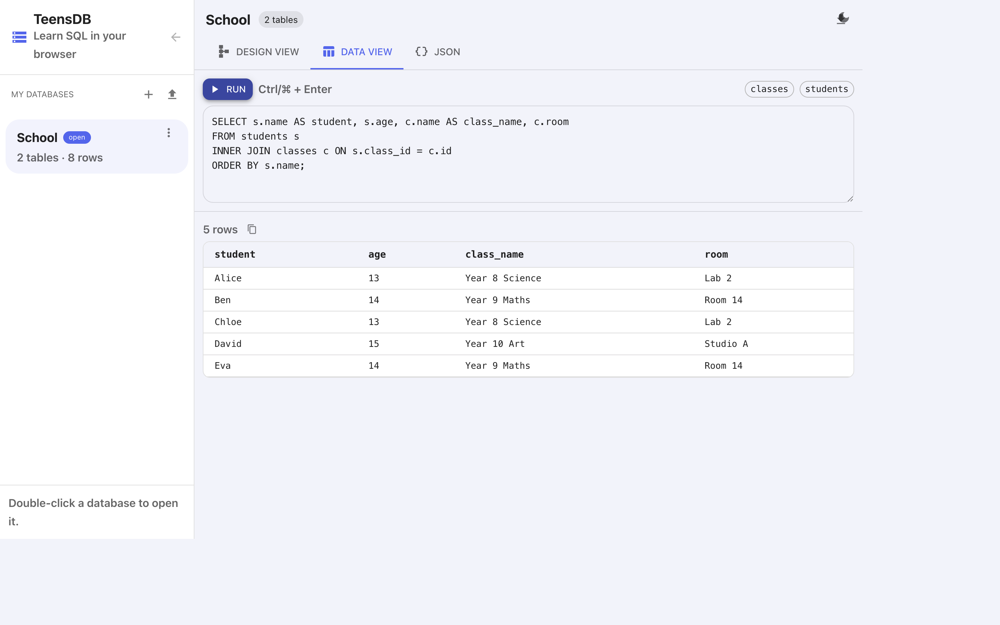

# The SQL editor

**Data view** is where you write SQL. The editor is on top. The result, or an error, is underneath.

{width=100%}

## Run a statement

1. Open a database and click **Data view**.
2. Type SQL in the box.
3. Click **Run**, or press `Ctrl`+`Enter` (`⌘`+`Enter` on a Mac).

The hint next to the button shows the shortcut: **Ctrl/⌘ + Enter**.

## Table chips

Above the editor, each table is a chip (`classes`, `students`). Click a chip to insert:

```sql
SELECT * FROM classes;
```

That is the fastest way to see every row in a table.

## What comes back

| You ran | You see |
|---------|---------|
| `SELECT` | A result table, plus a count such as `5 rows`. |
| `INSERT` | A green notice, for example `5 row(s) inserted`. |
| `UPDATE` | `N row(s) updated`. |
| `DELETE` | `N row(s) deleted`. |
| `CREATE TABLE` | `Table "students" created`. |
| `DROP TABLE` | `Table "students" dropped`. |
| A mistake | A red error. The message includes the statement number if you ran several statements. See [SQL errors](../troubleshooting/sql-errors.md). |

**Copy as TSV** (the copy icon next to the row count) copies the result as tab-separated text, so you can paste it into a spreadsheet.

## Several statements at once

Separate statements with a semicolon. TeensDB runs them in order, against the database as each one leaves it.

```sql
DROP TABLE IF EXISTS students;
DROP TABLE IF EXISTS classes;
CREATE TABLE classes (
  id INTEGER PRIMARY KEY AUTOINCREMENT,
  name TEXT NOT NULL,
  room TEXT
);
INSERT INTO classes (name, room) VALUES ('Year 8 Science', 'Lab 2');
```

Notices stack, one per statement. If statement 3 fails, statements 1 and 2 have already run.

## Capitals do not matter

`select`, `SELECT`, and `Select` are the same. Table and column names are also matched without caring about capitals. The examples in this documentation use capitals for SQL words so they stand out.

## The editor does not change Design view's layout

Running `CREATE TABLE` adds a card to the diagram. Running `INSERT` does not move cards. Dragging cards does not change query results.

The statement reference is in [SQL reference](../sql/reference.md). A full script you can paste is in [A worked example: School](school-example.md).
