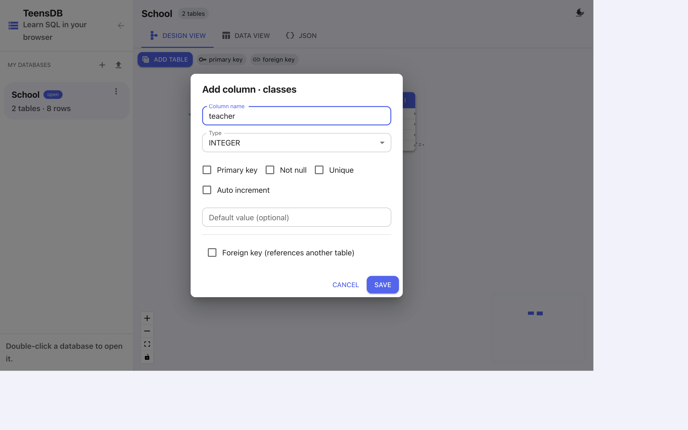

# Columns

A column has a name, a type, and optional rules. You add and edit columns from the table card.

## Add a column

1. On the table card, click **+** (**Add column**).
2. Fill in the dialog.
3. Click **Save**. **Save** stays disabled until the column has a name.

{width=100%}

| Field | What to enter |
|-------|----------------|
| **Column name** | A short name: `name`, `age`, `room`, `class_id`. |
| **Type** | `INTEGER`, `REAL`, `TEXT`, or `BOOLEAN`. |
| **Primary key** | Tick this on the column that identifies the row. A table should have one. |
| **Not null** | The column must have a value. Empty is rejected. |
| **Unique** | No two rows may store the same value. Primary key already implies this. |
| **Auto increment** | For an integer primary key. TeensDB fills the next number when you omit the column on insert. |
| **Default value** | Used when an `INSERT` does not mention the column. Leave blank for no default. |
| **Foreign key** | This column points at a column in another table. See [Foreign keys](foreign-keys.md). |

Double-click a column on the card to open the same dialog in edit mode (**Edit column · table**).

## Types

| Type | Stores | Examples |
|------|--------|----------|
| `INTEGER` | Whole numbers | `13`, `0`, `-2` |
| `REAL` | Numbers with a fractional part | `3.5`, `9.99` |
| `TEXT` | Text | `'Alice'`, `'Lab 2'` |
| `BOOLEAN` | True or false | `TRUE`, `FALSE` |

TeensDB coerces values when you insert them. The number `13` stored in a `TEXT` column becomes the text `"13"`. The text `'13'` stored in an `INTEGER` column becomes the number `13`. A value that cannot be coerced becomes `NULL` — and a `NOT NULL` column will then reject the row.

## Marks on the card

After you save, the card shows the rules without opening the dialog:

- A key icon is the primary key.
- A link icon is a foreign key.
- A red dot after the type means **Not null**.

In the School diagram, `classes.name` is `TEXT` with a red dot, so every class must have a name. `room` has no dot, so a class may have no room yet.

## Delete a column

Hover the column on the card. A trash icon appears at the right. Click it and confirm. That removes the column and the value from every row. The other columns stay.

There is no `ALTER TABLE`. From **Data view** the way to change columns is:

```sql
DROP TABLE classes;
CREATE TABLE classes (
  id INTEGER PRIMARY KEY AUTOINCREMENT,
  name TEXT NOT NULL,
  room TEXT,
  teacher TEXT
);
```

`DROP TABLE` deletes the rows as well. If you need to keep them, copy them out with `SELECT` first, or edit the column on the diagram, which keeps existing rows.

## Names

Column names follow the same rules as table names: letters, digits, underscores, and they are matched without caring about capitals. `Name` and `name` are the same column.

Do not use a reserved SQL word as a name. Words such as `SELECT`, `FROM`, `TABLE`, `ORDER`, and `GROUP` are reserved. `name`, `age`, `room`, and `count` are safe — `COUNT` is a function name, not a reserved word, so it can be a column. When you are unsure, pick a specific name (`student_count`) instead.
