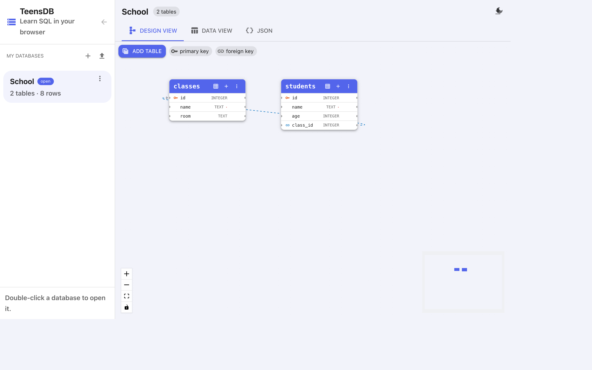

# Design view

**Design view** is the entity-relationship diagram for the open database. Each table is a card. Columns are rows on the card. A dashed line is a foreign key.

{width=100%}

In the picture, `School` has two tables:

- `classes` — `id` (primary key), `name` (required), `room`.
- `students` — `id` (primary key), `name` (required), `age`, and `class_id`, which points at `classes.id`.

## Reading a table card

| Mark | Meaning |
|------|---------|
| Key icon | Primary key. |
| Link icon | Foreign key. |
| Red dot after the type | `NOT NULL`. The column must have a value. |
| Type on the right | `INTEGER`, `REAL`, `TEXT`, or `BOOLEAN`. |

The three icons in the blue header are:

| Icon | Action |
|------|--------|
| Grid | **Input data** — open the row editor. |
| **+** | **Add column**. |
| **⋮** | **Input data**, **Add column**, **Rename table**, **Delete table**. |

Double-click a column name to edit that column.

## Moving around

- Drag a card to rearrange the diagram. The position is stored in the JSON, so the layout comes back next time you open the database.
- Drag the background to pan.
- Use the **+** / **−** controls, or the scroll wheel, to zoom.
- The fit control frames every table.
- The lock control stops cards from being dragged.
- The mini-map in the corner shows where you are when the diagram is larger than the window.

The legend at the top of the canvas reminds you: a key icon is a primary key, a link icon is a foreign key.

## Two ways to change the schema

Anything you do on the diagram can also be done in SQL, and the other way around.

| On the diagram | In SQL |
|----------------|--------|
| **Add table** | `CREATE TABLE` |
| **Delete table** | `DROP TABLE` |
| **Add column** / edit column | Include the column in `CREATE TABLE` (there is no `ALTER TABLE`) |
| Drag a link between tables | `REFERENCES` in `CREATE TABLE` |
| **Input data** | `INSERT`, `UPDATE`, `DELETE` |

TeensDB does not have `ALTER TABLE`. To change a table from SQL you drop it and create it again. The diagram is the easier way to add one column without rewriting the table. See [Columns](columns.md).

## Pages in this section

- [Tables](tables.md)
- [Columns](columns.md)
- [Foreign keys](foreign-keys.md)
- [Typing rows in the grid](input-data.md)
