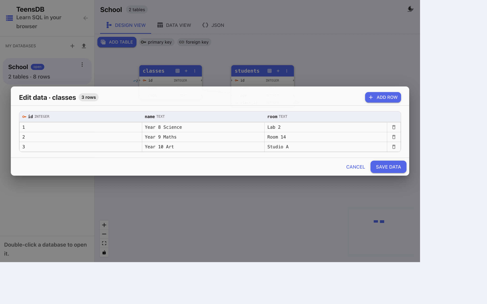

# Typing rows in the grid

You do not have to write `INSERT` to put data in a table. Each card has an **Input data** button (the grid icon).

{width=100%}

The dialog title is **Edit data · classes**, with a count of the rows. Columns are the table headers, including the type.

## Edit

- Click a cell and type. `INTEGER` cells accept whole numbers. `TEXT` cells accept any text.
- **Add row** appends an empty row. Leave an auto-increment primary key blank and TeensDB assigns the next number when you save.
- The trash icon on the right deletes that row.
- **Save data** writes the grid back into the database.
- **Cancel** closes the dialog and keeps the old rows.

The grid is a view of the same rows SQL sees. After you save, `SELECT * FROM classes;` returns what you typed.

## When to use the grid

| Use the grid when | Use SQL when |
|-------------------|--------------|
| You are entering a few rows by hand. | You are inserting many rows at once. |
| You want to fix a typo in one cell. | You want to change every row that matches a condition. |
| You are showing that a table is just a grid of values. | You are practising `INSERT`, `UPDATE`, or `DELETE`. |

## Primary keys in the grid

The `id` column is the primary key. Do not give two rows the same `id`. If you clear an `id` on a new row, auto increment fills it. If you type an `id` that is already used, save fails with a duplicate-value error.

## NULL

An empty cell is `NULL` — no value, which is different from `0` or from an empty text `''`. A column marked **Not null** (red dot on the diagram) cannot be saved empty.

Next: run a query against these rows in [the SQL editor](../data/sql-editor.md).
