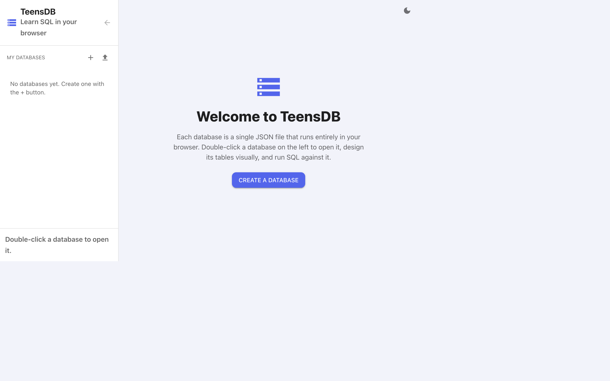

# Opening TeensDB

TeensDB is part of SemiBlock Build. You use the same account as the other SemiBlock editors.

1. Open [https://build.semiblock.ai](https://build.semiblock.ai) and sign in.
2. Go to [https://build.semiblock.ai/teensDB](https://build.semiblock.ai/teensDB).

If your account has no databases yet, you land on the welcome screen.

{width=100%}

The welcome text is the whole idea of the tool:

> Each database is a single JSON file that runs entirely in your browser. Double-click a database on the left to open it, design its tables visually, and run SQL against it.

## What you see

| Part of the screen | What it does |
|--------------------|--------------|
| **TeensDB** (top left) | Returns to the SemiBlock Build home page. |
| **My Databases** | Lists every TeensDB database on your account. |
| **+** | Creates a new database. The browser asks you for a name. |
| **Upload arrow** | Imports a `.json` file that was exported from TeensDB. |
| **Moon icon** (top right) | Switches between light and dark mode. |

Double-click a name in the sidebar to open it. A single click only selects it. The footer of the sidebar says the same thing: **Double-click a database to open it.**

## A note about the screen size

TeensDB is a desktop workspace. The sidebar, the diagram, and the SQL editor sit side by side. Use a laptop or a desktop browser, and make the window wide enough that the three tabs (**Design view**, **Data view**, **JSON**) are visible.

## If the page does not open

TeensDB is a feature on the SemiBlock account. If the page redirects you away, or the menu item is missing, the feature is not enabled for that login. Sign in with an account that has TeensDB, or ask the person who manages the school account to turn it on.

You do not install anything. There is no local database server to start.
