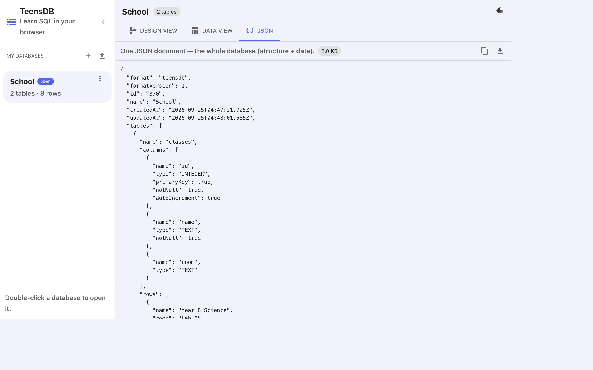

# The JSON document

Every TeensDB database is one JSON document. The **JSON** tab shows it. Structure and data are in the same file.

{width=100%}

The toolbar says **One JSON document — the whole database (structure + data).** The chip is the size (`2.0 KB` for the School example). The copy icon copies the text. The download icon saves a `.json` file.

## Shape

```json
{
  "format": "teensdb",
  "formatVersion": 1,
  "id": "370",
  "name": "School",
  "createdAt": "2026-09-25T04:47:21.725Z",
  "updatedAt": "2026-09-25T04:48:01.585Z",
  "tables": []
}
```

| Field | Meaning |
|-------|---------|
| `format` | Always `"teensdb"`. Import rejects a file without this. |
| `formatVersion` | `1`. The current layout. |
| `id` | The id of this database on your account. |
| `name` | The name in the sidebar. |
| `createdAt`, `updatedAt` | UTC timestamps. |
| `description` | Optional. Omitted when empty. |
| `tables` | Every table, in order. |

## A table

```json
{
  "name": "students",
  "position": { "x": 460, "y": 80 },
  "columns": [
    {
      "name": "id",
      "type": "INTEGER",
      "primaryKey": true,
      "notNull": true,
      "autoIncrement": true
    },
    { "name": "name", "type": "TEXT", "notNull": true },
    { "name": "age", "type": "INTEGER" },
    {
      "name": "class_id",
      "type": "INTEGER",
      "references": { "table": "classes", "column": "id" }
    }
  ],
  "rows": [
    { "id": 1, "name": "Alice", "age": 13, "class_id": 1 }
  ]
}
```

| Field | Meaning |
|-------|---------|
| `position` | Where the card sits on the diagram. Queries ignore it. |
| `columns` | Name, type, and rules. Missing flags mean false. |
| `references` | The foreign key. This is the dashed line. |
| `rows` | One object per row. Keys are column names. |

`NULL` is JSON `null`. A column that has never been set may be omitted from a row object; TeensDB treats that as `NULL`.

## Do not hand-edit unless you mean to

The JSON tab is read-only on screen. To change data, use the diagram, the grid, or SQL.

You can edit a downloaded file in a text editor and import it again. If you do:

- Keep `format` set to `"teensdb"`.
- Use only `INTEGER`, `REAL`, `TEXT`, and `BOOLEAN`.
- Make `references.table` and `references.column` name a table and column that exist.
- Keep row values the right kind of JSON value: numbers for `INTEGER` and `REAL`, strings for `TEXT`, `true` / `false` for `BOOLEAN`.

A file that is not JSON, or that is missing `format`, will not import. See [Import, download, and duplicate](import-export.md).
